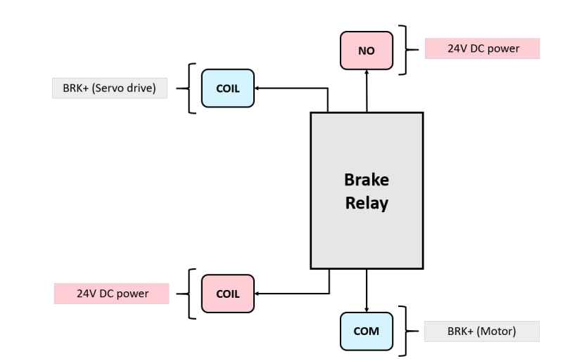

## Relays & Relay Bases

---

### 1. Relay SRN-24V-AC Coil 24VDC 4 Inverters 14 Pins (x6)

#### Definition
A **relay** is an electromechanical device used to control and isolate electrical circuits.  
It allows the control of loads (motors, indicator lights, contactors, etc.) using a low-voltage control signal.

#### Operation
- **Electromagnetic coil**: When powered, generates a magnetic field that attracts a metal armature.  
- **Armature movement**: Closes the electrical contacts, allowing current to flow in the controlled circuit.  

#### Functions
- Controls the **BRK+ (24V)** to the motor brakes.  
- **Coil (A1, A2):** Activation coil.  
- **NO/NC contacts:** Output paths to the motor or for status feedback.  

### 2. Relay Base for 14-Pin Relays (x6)

#### Definition
A **relay base** is the mounting interface installed in the control panel.  
It allows you to plug in the relay without hard-wiring it directly, making maintenance, replacement, and wiring much easier.

#### Advantages of Using a Relay Base
- Easy replacement if the relay fails (**plug & play**)  
- No need to disconnect wires during maintenance  
- Strong DIN-rail mounting inside the electrical cabinet  
- Clear numbered terminals → reduces wiring errors  
- Safer and more professional industrial installation  
