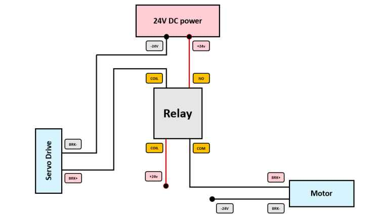

## Three-Phase Motors (x6)

### Definition
The **Leadshine ELM1H-0200MA60E** motor is an industrial AC three-phase servomotor designed for high-precision motion systems.  
It is controlled by the **EL7-EC400N servo drive** for precise motion control.

---

### Reasons for Using Leadshine ELM1H-0200MA60E Motors
- High precision  
- Fast response  
- Stable torque  
- Perfect compatibility with EL7-EC400N servo drive  
- Industrial reliability  

---

### How the EL7-EC400N Servo Drive Powers and Controls the Motor
- Powered by **single-phase AC (230V)**  
- Converts AC energy into internal DC  
- Uses an internal inverter to generate **variable three-phase AC voltage**  
- This voltage powers and precisely controls the ELM1H-0200MA60E motor  

---

### Motor Brakes
The **holding brake** mechanically maintains the position of the robot’s axes during a power outage.  
Its fail-safe operation makes it an essential safety and reliability component in multi-axis industrial robots.

- **Without power:** Brake engaged → shaft prevented from rotating  
- **With power:** Brake released → motor rotates freely  

#### Functions of Electromagnetic Brakes
- Hold position when stopped  
- Prevent arm slippage or drop  

**Control:**  
A relay is used to supply **24V DC** to the brake.  
