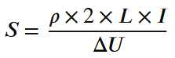

## Ground Terminal & Wiring

---

### 1. Ground Terminal 2.5 mm² (x7)

#### Definition
A **2.5 mm² ground terminal** is a special terminal used in electrical cabinets for connecting protective conductors (PE).  
It ensures grounding of metallic equipment to protect people and installations from insulation faults.

#### Roles in an Electrical Cabinet
- Grounding of:  
  - Cabinets and metal frames  
  - Motors  
  - Sensors and actuators  
- Fault current evacuation  
- Triggering protections (circuit breakers, RCDs)  
- Protecting people from electric shocks  

---

### 2. Wiring Philosophy

#### Color-Coded Wiring

| Color        | Meaning            | Function                                                                 |
|--------------|--------------------|--------------------------------------------------------------------------|
| **Red**      | Line (L)           | Carries the voltage from the power source to the load                    |
| **Blue**     | Neutral (N)        | Returns the current back to the power source                             |
| **Yellow-Green** | Protection Earth (PE) | Provides a path for fault current if a live conductor touches metal parts |

---

#### Standard Cable Section

The section of an electrical cable, expressed in **mm²**, represents the cross-sectional area of its conductor.  
It determines the cable’s ability to carry current without overheating. Selection depends on **current (A)**, **cable length (m)**, and **voltage (230V/400V)**.

**Formula parameters:**
- \( S \): Cable section in mm²  
- \( \rho \): Conductor resistivity (Copper = 0.0179 Ω·mm²/m)  
- \( L \): Conductor length in meters (m)  
- \( I \): Current in amperes (A)  
- \( \Delta U \): Allowable voltage drop (V), generally 2%–3% of nominal voltage (e.g., 4.6V for 230V)  

#### Purpose
- Avoid overheating  
- Limit voltage drop  
- Ensure safety of equipment and personnel  
- Comply with electrical standards  
