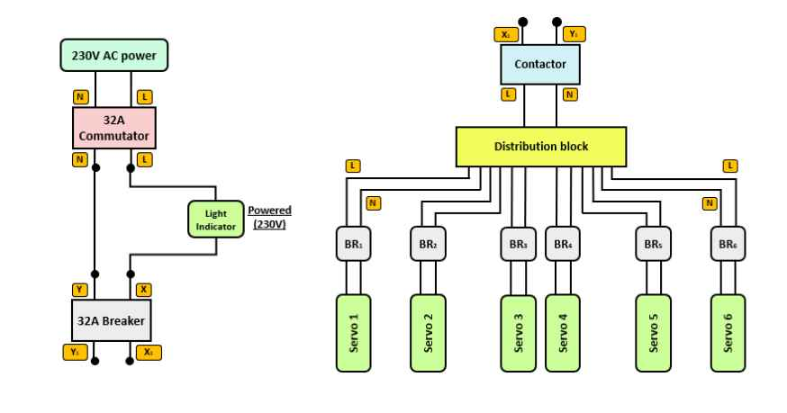
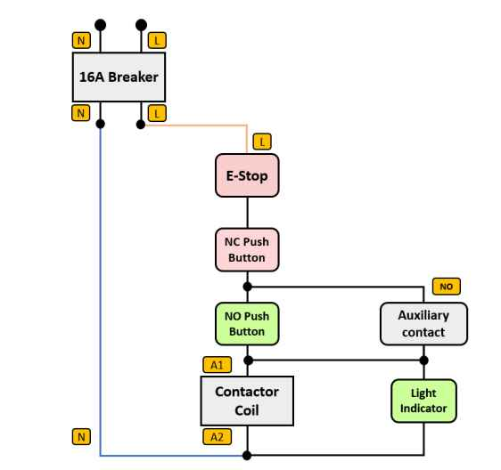

# MODULE 2: Power Supply & Protections

---

## 1. 230V AC Power Circuit – General Diagram

**Flow:**  
230V AC Power Supply → Switch → 32A Circuit Breaker → Contactor → Distribution to servo-drives and motors  

---

## 2. Key Components

### Switch
- A control device used in industrial electrical cabinets to manually make or break an electrical circuit.  
- **Model used:** 0-1 SAB Salzer ON/OFF rotary switch → general ON/OFF control of the robot command (to allow or cut the robot’s control chain).  

---

### Circuit Breaker
- Electrical safety device that protects a circuit against overcurrent (overloads or short circuits).  
- **Model used:** Modular circuit breaker 1P+N 32A Schneider → protects main power supply and servo drives.  
- **Main circuit breaker rule:** Must cover the sum of consumptions of secondary circuits.  

**Example Calculation:**

| Secondary Circuit        | Current (A) |
|---------------------------|-------------|
| Servo drive               | 8 A         |
| Fan                       | 2 A         |
| Indicator lights + buttons| 1 A         |
| Contactors                | 5 A         |
| Other circuits            | 6 A         |
| **Total**                 | **22 A**    |

- **Why not 10A?** → Too small, would trip (22A > 10A).  
- **Why not 100A?** → Too large, dangerous: secondary circuits could be damaged before tripping.  

**Divisionary Circuit Breakers:**  
- **Model used:** DPN iC40N 1P+N 10A Acti9 Schneider (x7) → protects 24V power, fans, sockets, and contactor coils.  

**Servo Drive Example (Leadshine EL7-400N):**

| Parameter        | EL7-EC400N |
|------------------|------------|
| Power (W)        | 400        |
| Rated Current (A)| 3.5        |
| Peak Current (A) | 9.5        |

- A 10A breaker is suitable: protects motor/wiring against overcurrent while tolerating short peaks.  

---

### Contactor
- Electromechanical device for remote switching ON/OFF of a circuit.  
- **Model used:** LC1D25P7 32A 380V contactor (3-pole).  
- **Operation:**  
  - Coil (A1/A2) powered by 230V AC → magnetic field created.  
  - Power contacts close → current flows.  
  - Auxiliary contacts (NO/NC) change state:  
    - **NO (Normally Open):** closes when coil powered.  
    - **NC (Normally Closed):** opens when coil powered.  

---

### Indicator Lights
- Signaling devices (LED) showing operating status.  
- **Models used:**  
  - Green LED AD16-22DS 220V → system running.  
  - Red LED AD16-22DS 220V → system powered.  

---

### Power Distributor (Terminal Block)
- Distributes electrical power to several outputs/circuits from a single source.  
- **Models used:**  
  - 2P 15-hole distributor (L+N)  
  - 2P 7-hole distributor (L+N)  
- **Safety note:** 2P devices cut off both phase and neutral → better insulation than cutting phase only.  

---

## II. 230V AC Control Circuit – Simplified Diagram

- **Green push button (NO – Normally Open):** Contact open at rest, closes when pressed → allows current flow.  
- **Red push button (NC – Normally Closed):** Contact closed at rest, opens when pressed.  
- **E-STOP (NC – Normally Closed):** Safety push button designed to immediately cut off power to hazardous equipment in emergencies.  
